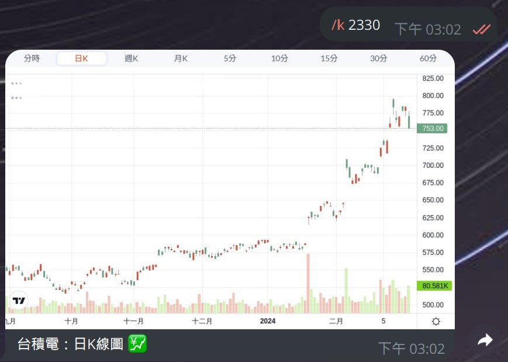
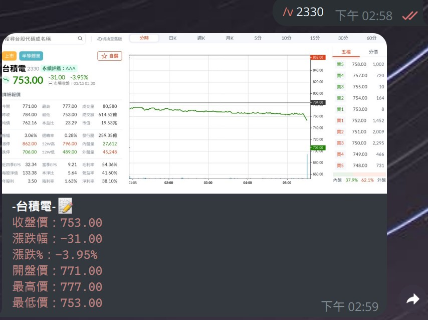
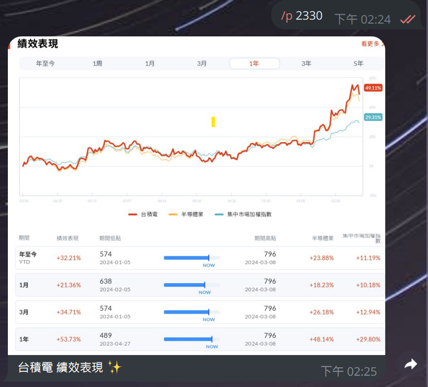
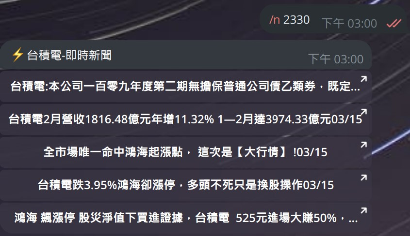
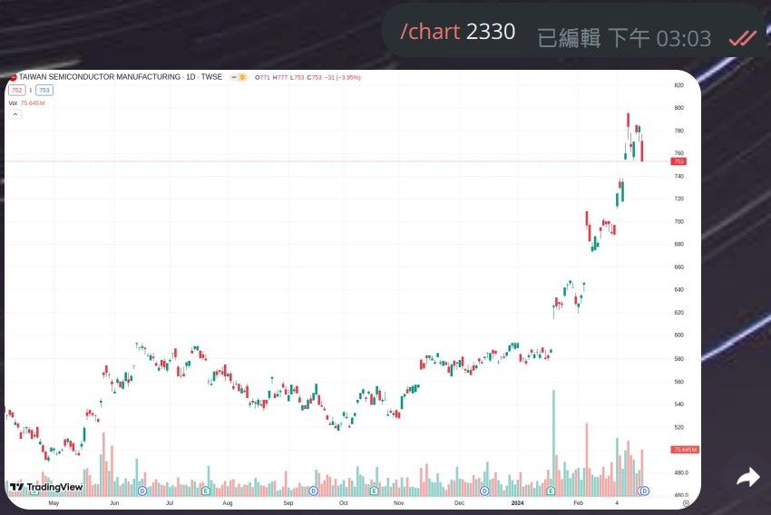
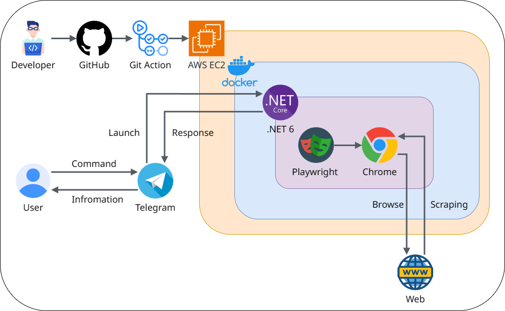

# TG 台股查詢機器人

<div style="text-align: center;">
    
</div>

## 使用教學  :memo:

示範機器人(若不想自己部屬也可以直接使用)

```cmd
https://t.me/Tian_Stock_bot
```

&nbsp;

使用方法：

👉 直接執行

下載後將appsettings.json裡的BotToken換成自己的API Key後執行檔案即可使用


👉 使用Docker執行

將程式pull下來後打包成Docker使用
```cmd
docker build -t 名稱 . --no-cache
```

&nbsp;

## 機器人指令 🗒

⭐️K線走勢圖
```cmd
/k 2330 d

--K線代碼--
h - 查詢時K線
d - 查詢日K線
w - 查詢週K線
m - 查詢月K線
5m - 查詢5分K線
10m - 查詢10分K線
15m - 查詢15分K線
30m - 查詢30分K線
60m - 查詢60分K線
```

&nbsp;

⭐️股價資訊
```cmd
/v 2330 
```

&nbsp;

⭐️績效資訊
```cmd
/p 2330 
```

&nbsp;

⭐️個股新聞
```cmd
/n 2330
```

&nbsp;

### 使用TradingView查詢

⭐️查看圖表
```cmd
/chart 2330
```


⭐️指定圖表顯示時間範圍
```cmd
/range 2330 1d

--時間範圍代碼--
1d   - 一日
5d   - 五日
1m   - 一個月
3m   - 三個月
6m   - 六個月
ytd  - 今年度
1y   - 一年
5y   - 五年
all  - 全部
```

&nbsp;

## 未來預計更新內容 📝

⭐️已知BUG
```cmd
1.TradingView讀取太多次會跳出登入介面
```
⭐️預計更新
```cmd
1.加入美股
```
&nbsp;

## 📄  專案介紹

### ✏️ 程式流程說明
```cmd
專案使用Git搭配GitHub Action，執行CICD自動部屬流程
將需要部屬的commit打上tag，push至GitHub觸發 GitHub Action

GitHub Action流程-
分為Build及Deploy
1. Build-測試程式是否能正常執行,成功執行完畢觸發Deploy流程
2. Deploy-執行前將TG BOT KEY加入至appsetting中
並將程式打包成Docker Images並上傳至Docker Hub
3. 登入EC2，將剛上傳的Docker Images Pull下來並執行

使用 C#.NET6 搭配 Telegram Bot套件製作
使用者傳送指令命令時觸發程式
利用 Playwright 爬蟲套件，依據使用者指令抓取指定內容並回傳資訊
```

&nbsp;

### 🖥 系統架構
&nbsp;


&nbsp;


